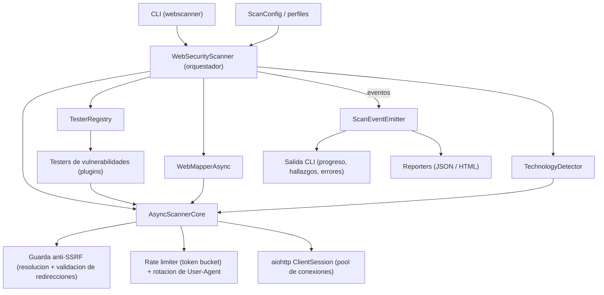

# Web Security Scanner

Escaner de seguridad web asincrono construido sobre `asyncio` y `aiohttp`, con
un sistema de plugins para los testers de vulnerabilidades y una arquitectura
orientada a eventos que desacopla el motor de escaneo de la presentacion.

**Version:** 5.2.0
**Uso previsto:** exclusivamente pruebas de seguridad autorizadas y formacion.
El escaneo de sistemas sobre los que no se dispone de permiso explicito puede
constituir un delito.

---

## Resumen ejecutivo

Web Security Scanner automatiza la fase de deteccion de un analisis de seguridad
web sobre objetivos HTTP/HTTPS. En una unica ejecucion:

- Rastrea la aplicacion objetivo y construye un mapa de su superficie
  (URLs, formularios, parametros, subdominios).
- Identifica el stack tecnologico (servidor, CMS, frameworks JavaScript,
  analitica, CDN/WAF) mediante firmas.
- Ejecuta un conjunto de testers de vulnerabilidades contra los parametros
  descubiertos, cada uno con un nivel de confianza asociado.
- Genera informes reproducibles en formato JSON y HTML.

El motor esta endurecido frente a objetivos hostiles: proteccion anti-SSRF en
las redirecciones, limites de memoria en las respuestas, timeouts de socket
granulares y cancelacion limpia ante interrupciones.

---

## Arquitectura del sistema



| Componente | Responsabilidad |
|------------|-----------------|
| `cli.py` | Punto de entrada unico. Parseo de argumentos, suscripcion a eventos, invocacion del escaneo y generacion de informes. |
| `web_security_scanner_async.py` | Orquestador. Descubre testers, aplica el perfil, coordina mapper y deteccion de tecnologias, aplica el limite global de duracion. |
| `core/scanner_core_async.py` | Cliente HTTP asincrono: pool de conexiones, rate limiting, cache de respuestas, rotacion de User-Agent, guarda anti-SSRF, limites de tamano y timeouts. |
| `modules/registry.py` | Descubrimiento y registro automatico de los testers. |
| `modules/vulnerability_testers/` | Plugins derivados de `VulnerabilityTester`. Un archivo por familia de vulnerabilidad. |
| `modules/web_mapper_async.py` | Rastreo del sitio, descubrimiento de subdominios y generacion del mapa HTML. |
| `modules/technology_detector.py` | Fingerprinting por firmas de servidor, CMS, frameworks y analitica. |
| `events/event_emitter.py` | Bus de eventos que desacopla el motor de la salida. |
| `reports.py` | Serializacion de resultados a JSON y HTML, con sanitizacion de secretos. |
| `utils/i18n.py` | Textos en ingles (`en`) y espanol (`es`). |

---

## Caracteristicas tecnicas

### Endurecimiento anti-SSRF

- Las redirecciones se siguen de forma manual, salto a salto.
- Antes de seguir cada salto, el host destino se resuelve por DNS (con cache) y
  cada direccion obtenida se valida.
- Se rechaza cualquier destino cuya IP sea privada, loopback, link-local,
  reservada, multicast o no especificada segun el modulo `ipaddress` de la
  biblioteca estandar. Esto bloquea, entre otros, el servicio de metadatos de
  nube en `169.254.169.254`.
- Un destino que no resuelve tambien aborta la peticion.
- El comportamiento se puede desactivar de forma explicita con
  `--allow-private-redirects` para objetivos internos autorizados.

### Resistencia a respuestas hostiles

- Techo de 5 MiB de cuerpo descomprimido por respuesta; el flujo se lee por
  fragmentos y se abandona al superarlo (proteccion frente a streams infinitos
  y bombas gzip/deflate).
- Timeouts de socket independientes: `sock_connect` para el establecimiento de
  la conexion y `sock_read` para el intervalo entre fragmentos, ademas del
  deadline global por peticion.
- Las respuestas truncadas se marcan como tales en el resultado.

### Capacidades de red

- Soporte de proxy HTTP/HTTPS a nivel de configuracion (`ScanConfig.proxy`).
- Rotacion de User-Agent: por defecto se elige uno al azar de un conjunto de
  agentes de escritorio actuales en cada peticion; se puede fijar uno concreto.
- Rate limiting global mediante token bucket configurable (`rate_limit`,
  `rate_burst`).
- Cabeceras estaticas adicionales inyectables a nivel de configuracion
  (`ScanConfig.headers`).

### Rastreo y descubrimiento

- Rastreador con limites de profundidad (`--max-depth`) y de numero de URLs
  (`--max-urls`), con corte preventivo ante trampas de arana; en ese caso se
  entrega un mapa parcial.
- Reconocimiento enriquecido con la tecnologia de `route-mapper` (Fase 1):
  siembra de la cola desde `/sitemap.xml` (`--sitemap`), mineria lexica de
  endpoints en bundles `.js` (`--parse-js` / `--no-parse-js`), cumplimiento del
  `Crawl-delay` de `robots.txt`, `jitter` en el retardo entre peticiones
  (`--jitter`), rotacion de `User-Agent` (`--ua-file`) y canalizacion por proxy
  HTTP o SOCKS5 (`--proxy`). Cada URL descubierta pasa por el `ScopeEngine`
  anti-SSRF de 3 capas (normalizacion, ambito de dominio y verificacion
  DNS/IP).
- Las rutas y parametros descubiertos en la Fase 1 alimentan automaticamente la
  cola de los 16 testers de vulnerabilidades (Fase 2).
- Descubrimiento de subdominios a partir de cabeceras CSP y de un ataque de
  diccionario DNS acotado, ejecutado fuera del bucle de eventos.
- Deteccion de tecnologias por firmas (regex y parseo de HTML), ejecutada en un
  hilo aparte por ser intensiva en CPU.

### Testers de vulnerabilidades

Todos derivan de `VulnerabilityTester` y comparten inyeccion de parametros
consciente de URL-encoding, captura de linea base, comparacion diferencial,
carga de payloads desde JSON, un limite de payloads por parametro
(`--max-payloads`) y una compuerta para payloads destructivos
(`--allow-destructive`, desactivada por defecto).

| Tester | Notas |
|--------|-------|
| SQL Injection | Basado en error y basado en tiempo, este ultimo con linea base de latencia y ronda de confirmacion. |
| XSS | Analisis sensible al contexto; la confianza se ajusta segun el `Content-Type` de la respuesta. |
| Command Injection | Deteccion por salida de comando, evitando falsos positivos con caracteres genericos. |
| Path Traversal | Deteccion por contenido de archivos de sistema, distinguiendo respuestas 403. |
| Open Redirect | Marcador unico en el destino de la redireccion. |
| SSRF | Deteccion de fuga de metadatos y de servicios internos. |
| NoSQL Injection | Deteccion por mensajes de error de motores NoSQL. |
| IDOR | Comparacion diferencial de objetos entre identificadores. |
| XXE | Entidades externas XML. |
| CSRF | Ausencia de proteccion anti-CSRF en formularios. |
| Header Security | Cabeceras de seguridad ausentes o con valores debiles; tolerante a mayusculas y a directivas modernas. |

Cada hallazgo lleva un nivel de confianza: `LOW`, `MEDIUM`, `HIGH` o
`CONFIRMED`.

### Sanitizacion de datos sensibles

Antes de escribir cualquier informe, los campos que pueden contener fragmentos
de peticion o respuesta se procesan con `mask_secrets`, que redacta tokens
`Authorization: Bearer`, credenciales `Basic`, cabeceras `Cookie` /
`Set-Cookie` y JWT en texto plano. Todos los valores del informe HTML se
escapan con `html.escape`.

---

## Instalacion y requisitos

- Python 3.10 o superior (el proyecto declara `requires-python >= 3.9`; el
  entorno de desarrollo y CI usa 3.12).
- Gestor de paquetes [`uv`](https://docs.astral.sh/uv/) recomendado.

```bash
# Con uv (crea el entorno y resuelve dependencias desde uv.lock)
uv sync

# Alternativa con pip
python -m venv .venv
source .venv/bin/activate
pip install -e .
```

Dependencias de ejecucion: `aiohttp`, `beautifulsoup4`, `colorama`, `pyyaml`,
`dnspython`.

---

## Guia de uso de la CLI

```bash
uv run webscanner scan <URL> [opciones]
# o, sin uv:
python -m web_security_scanner.cli scan <URL> [opciones]
```

### Opciones

| Opcion | Descripcion | Valor por defecto |
|--------|-------------|-------------------|
| `url` | URL objetivo, con esquema `http://` o `https://` (obligatorio). | - |
| `-p, --profile` | Perfil de escaneo: `quick`, `balanced`, `intense`, `mapping`. | `balanced` |
| `--threads` | Maximo de peticiones concurrentes; anula el valor del perfil. | segun perfil |
| `--timeout` | Timeout global por peticion, en segundos. | segun perfil |
| `--rate-limit` | Segundos minimos entre peticiones (0 desactiva el limite). | `0.0` |
| `--payload-delay` | Retardo entre payloads dentro de cada tester, en segundos. | `0.0` |
| `--max-payloads` | Maximo de payloads por parametro. | `50` |
| `--max-duration` | Tope global de tiempo de ejecucion de los testers, en segundos. | sin tope |
| `--allow-destructive` | Habilita payloads que pueden modificar o destruir estado del objetivo. | desactivado |
| `--no-verify-ssl` | Desactiva la verificacion del certificado TLS. | verificacion activa |
| `--allow-private-redirects` | Permite seguir redirecciones hacia IPs privadas o loopback (la guarda anti-SSRF esta activa por defecto). | desactivado |
| `--no-map` | Omite el rastreo y la generacion del mapa web. | mapa activo |
| `--max-depth` | Profundidad maxima de rastreo. | `3` |
| `--max-urls` | Tope de URLs que visitara el rastreador. | `1000` |
| `--sitemap` | Siembra la cola de rastreo desde `/sitemap.xml`. | desactivado |
| `--jitter` | Segundos aleatorios (+/-) sumados al retardo entre peticiones. | `0.0` |
| `--parse-js` / `--no-parse-js` | Activa o desactiva la mineria de endpoints en archivos `.js`. | activado |
| `--proxy` | Canaliza el trafico por un proxy `http://` o `socks5://`. | sin proxy |
| `--ua-file` | Archivo con un `User-Agent` por linea; rotacion por peticion. | pool interno |
| `-o, --output` | Directorio de salida para los informes. | `reports` |
| `-f, --format` | Formatos de informe, separados por comas: `json`, `html`. | `json,html` |
| `--lang` | Idioma de la salida: `en` o `es`. | `en` |
| `-v, --verbose` | Registro detallado. | desactivado |

### Codigos de salida

| Codigo | Significado |
|--------|-------------|
| `0` | Escaneo completado sin vulnerabilidades. |
| `1` | Escaneo completado con al menos una vulnerabilidad. |
| `2` | URL objetivo invalida. |
| `130` | Interrumpido por el usuario (Ctrl+C); cierre limpio. |

### Ejemplos

Escaneo basico con el perfil por defecto:

```bash
uv run webscanner scan https://example.com
```

Escaneo intensivo con concurrencia elevada y ambos informes:

```bash
uv run webscanner scan https://example.com -p intense --threads 50 -f json,html
```

Escaneo conservador con limitacion de peticiones y tope de duracion:

```bash
uv run webscanner scan https://example.com --rate-limit 0.5 --max-duration 600
```

Solo mapeo de la superficie, sin testers de inyeccion:

```bash
uv run webscanner scan https://example.com -p mapping
```

Objetivo interno autorizado detras de redirecciones privadas:

```bash
uv run webscanner scan https://intranet.local --allow-private-redirects --no-verify-ssl
```

---

## Formatos de salida

Los informes se escriben en el directorio indicado por `-o` con nombre
`scan_<AAAAMMDD_HHMMSS>.<ext>`.

| Formato | Contenido |
|---------|-----------|
| `json` | Estructura completa: objetivo, perfil, lista de vulnerabilidades (ordenadas por severidad y confianza), tecnologias detectadas y estadisticas. Apto para integracion y post-proceso. |
| `html` | Informe legible con las mismas secciones, con todos los campos escapados y los secretos redactados. |

Cuando el rastreo esta activo se genera ademas un mapa web en HTML como archivo
independiente, cuya ruta se indica al final de la ejecucion.

---

## Desarrollo y pruebas

```bash
# Suite de pruebas
uv run pytest

# Linter
uv run ruff check .

# Comprobacion de tipos
uv run mypy web_security_scanner
```

La suite usa `pytest` con `pytest-asyncio` en modo automatico. Los tests de los
testers viven en `tests/test_testers.py` y validan, para cada tester, un
verdadero positivo y la ausencia de los falsos positivos historicos.

### Estructura del repositorio

```
web_security_scanner/
    cli.py                     Punto de entrada de la CLI
    web_security_scanner_async.py   Orquestador
    banner.py                  Banner de arranque
    core/                      Cliente HTTP asincrono y configuracion
    events/                    Bus de eventos
    modules/
        registry.py            Registro de testers
        technology_detector.py Fingerprinting de tecnologias
        web_mapper_async.py    Rastreador y mapa web
        vulnerability_testers/ Plugins de deteccion
    utils/                     i18n y validacion
    languages.yaml             Cadenas traducidas
tests/                         Suite de pruebas
Documentacion/                 Documentacion tecnica complementaria
```

---

## Documentacion

Este `README.md` es la referencia principal de uso, instalacion y arquitectura.
Documentacion complementaria en `Documentacion/`:

- [COMANDOS.md](Documentacion/COMANDOS.md) - combinaciones de parametros y
  ejemplos de invocacion de la CLI.
- [MEJORAS_V5.md](Documentacion/MEJORAS_V5.md) - detalle tecnico de las mejoras
  introducidas en la version 5.2.0
- [COMPARATIVA_VERSIONES.md](Documentacion/COMPARATIVA_VERSIONES.md) - evolucion
  historica del proyecto de la v1.0 a la v5.2.0.

---

## Consideraciones legales

Esta herramienta se distribuye bajo licencia MIT (vease `LICENSE`) y se
proporciona sin garantia de ningun tipo. El uso responsable es responsabilidad
del operador: obtenga autorizacion por escrito antes de escanear cualquier
sistema, respete el alcance acordado y utilice configuraciones conservadoras
para no degradar el servicio objetivo.
